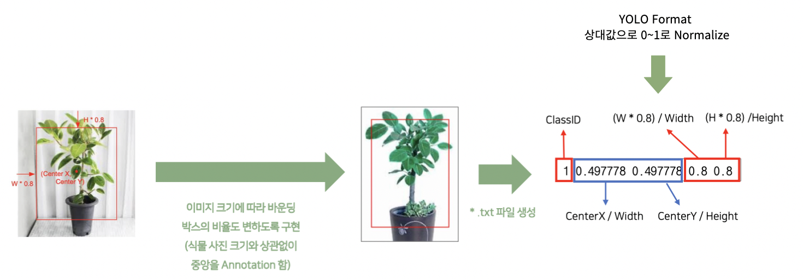
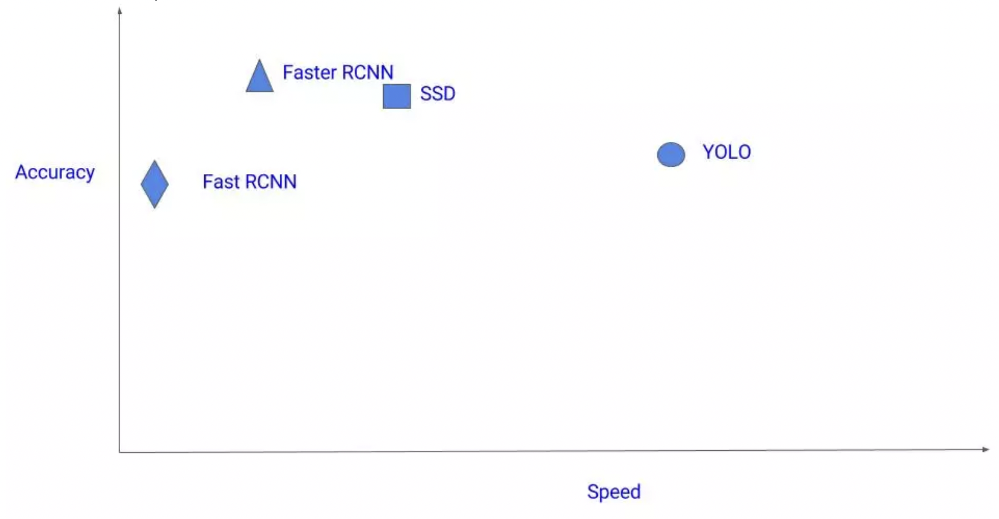
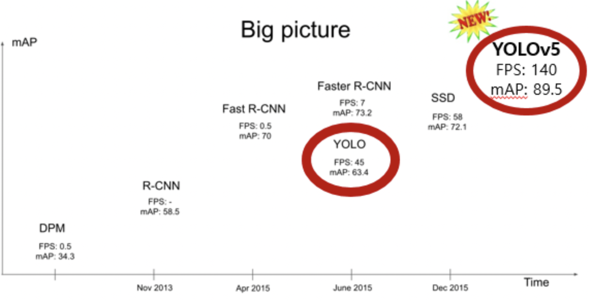
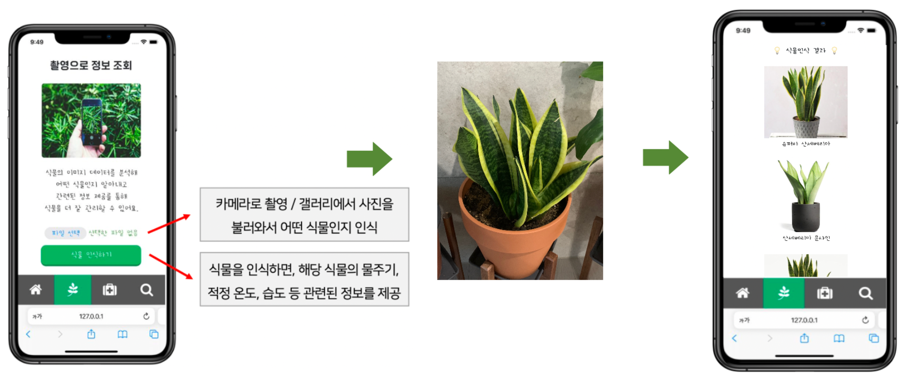
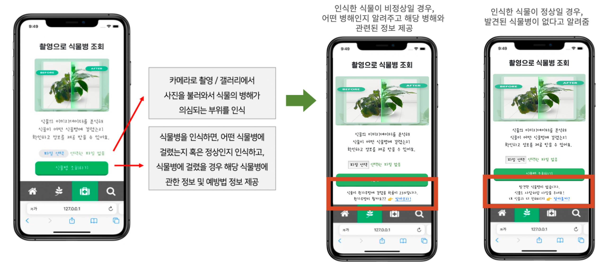

## 식물인식 및 식물병 인식 : DoctorPlant 반응형 웹앱 서비스

### 1. 프로젝트 개요 

- 배경

  - ''코로나 우울증''을 10명 중 7명이 경험했을 정도로 많은 사람들이 우울함을 느끼고 있음 

    https://www.dongascience.com/news.php?idx=39960

  - 반려식물은 우울감 및 부정적인 감정 해소에 긍정적인 효과를 줌

    https://jhealthmedia.joins.com/article/article_view.asp?pno=22506

  - 롯데 백화점은 지난해 홈가드닝 관련 매출이 전년대비 2배 이상 증가

  - LG '틔운', 교원 등 가정용 식물재배기도 인기를 끌고 있음 

  **=> 식물에 대한 사람들의 관심이 증가하고 있지만, 관리 방법을 모르는 경우가 존재.**

- 목표
  - **식물 인식 서비스** : 식물 사진을 통해 어떤 식물인지 인식함으로써 식물의 이름과 식물을 키우는 데에 필요한 정보 중심으로 관련 정보 제공
  - **식물병 인식 서비스** : 식물병이 의심되는 식물 사진을 통해 어떤 식물병에 걸렸는지 인식하고, 식물병의 종류와 예방법 정보 제공
  - **반려식물 등록** : 식물의 종류에 따라 물주는 주기, 광도 등 식물별로 맞춤형 관리 서비스를 제공
  - **유용한 정보 제공** : 사용자의 위치 정보 제공 동의를 받아 자외선 지수나 습도 등 관련정보 제공

### 2. 데이터

- 식물 인식
  ```text
  - 총 데이터 수 : 21,805개 (16가지의 식물)
    - 오렌지자스민 (1486), 뱅갈고무나무 (1683), 스투키 (1460), 로즈마리 (1328), 아이비 (983), 금전수 (1508), 여인초 (1397), 율마 (1526),
    - 스킨답서스 (1368), 산세베리아 (1168), 홍콩야자 (1431), 산호수 (1000), 개운죽 (1559), 테이블야자 (990), 행운목 (1254), 몬스테라 (1665)
  - 식물 선정 기준 : 오늘의 집, 쿠팡, 11번가, 옥션 4가지 사이트에서 ‘실내 식물’을 검색했을 때, 공통적으로 가장 많이 판매되는 식물 16가지 선정
  - 데이터 수집 방법 : 네이버, 구글, Bing에서 식물 이미지 크롤링
  ```

- 식물 병해 인식
  ```text
  - 총 데이터 수 : 6811개 (2가지의 병해)
    - 흰가루병 2265개, 노균병 1546개, 정상 데이터 3000개
  - 식물 선정 기준 : ‘식물 인식’ 단계에서 선정된 실내 식물 16종이 가장 많이 걸린 식물병 2가지 선정
  - 데이터 수집 방법 : AIHub 노지 작물 질병 진단 이미지 및 라벨링 데이터
  ```
  
- 위치 정보, 온도, 습도, 날씨, 시간별 기온, 자외선 지수 API
  - 위치 정보 : geolocation 기술로 사용자의 현재 위치를 확인 한 후, kakao api 요청해서 주소 받아옴
  - 온도, 습도, 날씨, 시간별 기온, 자외선 지수 정보 : 기상청 단기예보 조회 서비스 weatherapi.com
    
- 식물 검색에 사용되는 데이터 
  - 식물 종류 : 250종
  - 식물 선정 기준 : 오늘의 집, 쿠팡, 11번가, 옥션 4가지 사이트 및 플립 사이트에서 실내 식물로 인기 있는 식물 250종 선정
  - 데이터 수집 : 플립(https://fuleaf.com)에 있는 식물 이름, 설명, 물주기, 햇빛, 습도, 온도에 관한 정보 크롤링

### 3. 전처리

- 식물 인식 Yolov5 모델 

  - 크롤링한 식물 이미지 데이터 -> 라벨링 데이터의 부재
  - 사용자가 식물을 화면 가운데에서 찍는다는 시나리오 가정 -> 이미지 중심 좌표 위주로 임의의 바운딩 박스 좌표를 구해 라벨링 데이터 생성 

  

- 식물 병해 인식 Yolov5 모델

  - AIHub 노지작물 질병진단 이미지, 라벨 데이터 활용 → 동일한 파일명으로 이미지와 라벨 데이터가 매치되어 있음
  - Yolov5 모델에서 필요한 라벨 데이터 형식은 .txt 파일이므로, AIHub에 업로드 되어 있는 json 파일의 값을 추출하여 변환

  

### 4. 모델 선정

#### Yolov5s 



- Object detection 분야에서 쓰이는 모델로는, Faster-RCNN, MobileNet, SSD 등 많은 모델 존재
- 그 중, Yolo 모델이 정확도는 조금 떨어지지만, 속도 측면에서는 빠르다는 점으로 해당 프로젝트에서는 Yolo 모델을 사용




- Yolo가 FPS가 높은 반면에 mAP는 비교적 낮은 모델이었다. 하지만, yolov5는 FPS와 mAP 측면에서 모두 뛰어난 성능을 발휘하였기 때문에 해당 프로젝트에서는 Yolo 모델 중 Yolov5 모델을 선택하였다. 


- Yolov5 모델 중에서도 크기별로 s,m,l,x 로 나눠져있다. s가 x에 비해 정확도는 떨어지지만 속도 측면에서는 더 빠르기 때문에 해당 프로젝트에서는 **Yolov5s 모델**을 선택하였다. 

### 5. 모델 학습

#### 5-1. 식물인식 ResNet 50 

```python
# ResNet50 model 불러오기 
base_model = ResNet50(include_top=False, input_shape =(224, 224 ,3), weights = 'imagenet')
base_model.summary()
```

- 이미지 전체를 256 x 256 사이즈로 Resizing 한 후, 중심을 기준으로 다시 224 x 224 사이즈로 CenterCrop 진행

```python
# ResNet50 전이학습 
base_model.trainable = False

## 모델 layer 설계
inputs = Input(shape=(None, None, 3))
x = tf.keras.layers.experimental.preprocessing.Resizing(256,256)(inputs) 
x = tf.keras.layers.experimental.preprocessing.CenterCrop(224,224)(x)
x = tf.keras.applications.resnet50.preprocess_input(x)
x = base_model(x, training = False)
x = Flatten()(x)   # Fully Connected에 온전하게 학습을 위해 펼쳐준다 

outputs = Dense(5, activation = 'softmax')(x) # Softmax 함수로 n개 분류

model_res = tf.keras.Model(inputs, outputs) # model_res 란 이름의 인풋과 아웃풋이 정해진 모델
```

- 모든 이미지를 1/255로 스케일을 조정 및 정규화 진행

```python
# 입력 데이터 정규화를 위한 클래스 정의
def forward(input):
    mean = np.array([0.485, 0.456, 0.406])
    std = np.array([0.229, 0.224, 0.225])
    mean = mean.reshape(1, 1, 1, 3)
    std = std.reshape(1, 1, 1, 3)
    return (input - mean) / std
```

```python
# 이미지 정규화를 위해 위에서 만든 forward 함수를 ImageDataGenerator에 적용하여 진행
train_datagan = ImageDataGenerator(rescale=1./255, preprocessing_function = forward)
valid_datagan = ImageDataGenerator(rescale=1./255, preprocessing_function = forward)
```

#### 5-2. 식물인식 및 식물 병해 인식 Yolov5s 최종 모델

- 학습에 사용될 데이터 셋을 yaml 파일에 정리

  ```text
  {'path': './datasets_yolo/', 
  'train': 'images/train', 
  'val': 'images/valid', 
  'test': 'images/test', 
  'nc': 16, 
  'names': ['orangejasmin', 'benghaltree', 'stuckyi', 'rosmari', 'ivy', 'geumjeonsoo', 'yeoincho', 'wilma', 'skindapsus', 'sansevieria', 'hongkong', 'sanhosoo', 'gaewoonjuk', 'tableyaja', 'hangwoonmok', 'monstera']}
  ```

- ./models/yolov5s.yaml 경로에 들어가서 nc (class 수) 변경

- Yolov5s model 불러와서 train.py 실행

  ```python
  !python train.py --img 224 --batch 20 --epochs 20 --data data/datasets.yaml --cfg ./models/yolov5s.yaml --weights yolov5s.pt --name yolov5s_results
  ```

### 6. 추론 및 결과

- 식물 인식 서비스 결과 

  - 실제 가정에 있는 산세베리아 식물로 인식 테스트 해 본 결과, 산세베리아 종류별로 나타나는 것을 확인 할 수 있다.

    

- 식물 병해 인식 서비스 결과

  

### 7. 참고자료

모델 성능 비교 : https://github.com/sejongresearch/FlowerClassification/issues/18
